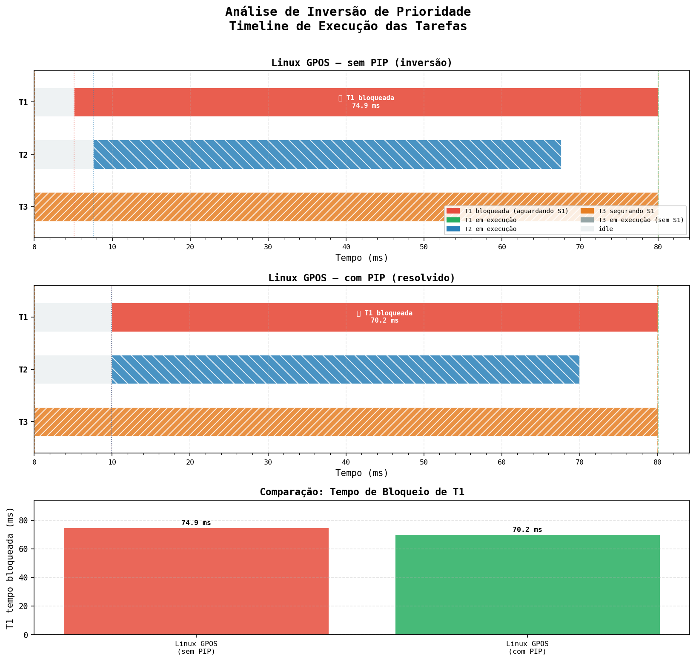

# Caracterização Estatística de Determinismo e Análise de Inversão de Prioridade: GPOS vs. RTOS

- **Disciplina:** Arquitetura de Sistemas Computacionais — PPGIA/PUC-PR
- **Autor:** Fernando Dantas
- **Data:** Abril de 2026
- **Status:** Protocolo técnico preparado; resultados quantitativos pendentes de coleta experimental.

---

## Resumo

Este trabalho apresenta uma análise quantitativa e qualitativa do comportamento de escalonamento em dois ambientes distintos: um sistema operacional de propósito geral (GPOS) Linux Ubuntu 24.04 com política `SCHED_FIFO` e um sistema operacional de tempo real (RTOS) Zephyr emulado via QEMU. São investigados o jitter de ativação de uma tarefa periódica de alta prioridade sob estresse de CPU, o fenômeno da Inversão de Prioridade com e sem o Protocolo de Herança de Prioridade (PIP), e a validade do limite de escalonabilidade de Liu & Layland (Rate Monotonic Scheduling) para o conjunto de tarefas definido. Os resultados quantitativos serão registrados após a coleta experimental.

---

## 1. Introdução

O tempo é uma dimensão de correção lógica em sistemas de controle crítico. Em contraste com sistemas de propósito geral, onde o escalonador otimiza throughput e fairness, um RTOS garante que tarefas de alta prioridade atendam seus prazos de forma determinística e verificável. O Mars Pathfinder (1997) ilustra a relevância prática deste tema: uma inversão de prioridade não tratada entre tarefas de gerenciamento de barramento e aquisição de dados provocou resets periódicos do sistema em solo marciano [[Jones97]](#ref-jones97).

Este trabalho caracteriza matematicamente a diferença entre os dois paradigmas por meio de três experimentos complementares:

1. **Jitter** — variabilidade no tempo de início de uma tarefa periódica de alta prioridade sob estresse de CPU;
2. **Inversão de Prioridade** — bloqueio ilimitado de tarefa de alta prioridade por tarefas de menor prioridade intermediária;
3. **Validação RMS** — verificação do limite teórico de Liu & Layland para o conjunto de tarefas definido.

---

## 2. Metodologia

### 2.1 Hardware Host

| Atributo | Valor |
|---|---|
| Hardware | Dell OptiPlex 9010 (Desktop) |
| CPU | Intel Core i7-3770 @ 3.40 GHz — 4 cores / 8 threads (HT habilitado) |
| RAM | 16 GB |
| SO Host | Ubuntu 24.04.4 LTS (kernel 6.8.0-107-generic) |
| Experimentos Linux | Executados diretamente no host (bare metal) |

### 2.2 Ferramentas

| Ferramenta | Uso |
|---|---|
| `gcc` + `pthreads` | Compilação e execução dos experimentos Linux (Ambiente A) |
| `mlockall(MCL_CURRENT \| MCL_FUTURE)` | Bloqueia paginação para eliminar page faults durante medição |
| `SCHED_FIFO` + `PTHREAD_EXPLICIT_SCHED` | Política de tempo real no Linux; bypassa o CFS |
| `clock_nanosleep(TIMER_ABSTIME)` | Sleep absoluto para período sem deriva acumulada |
| `CLOCK_THREAD_CPUTIME_ID` | Medição de CPU-time por thread (isolado de preempções) |
| `PTHREAD_PRIO_INHERIT` | Protocolo de herança de prioridade no Linux |
| Zephyr RTOS (main branch) | Kernel RTOS compilado para `qemu_x86` |
| `k_sleep(K_TIMEOUT_ABS_TICKS)` | Equivalente Zephyr ao `clock_nanosleep(TIMER_ABSTIME)` |
| `k_mutex` / `k_sem` | Mutex com PIP (k_mutex) e sem PIP (k_sem) no Zephyr |
| `pidstat`, `perf stat` | Monitoramento de CPU e trocas de contexto no Linux |
| Python 3.13 + matplotlib | Geração de histogramas e timelines |

### 2.3 Modelo de Tarefas

As três tarefas implementadas são descritas na Tabela 1. As cargas (Ci) foram calibradas para satisfazer o limite de Liu & Layland antes de ser intencionalmente excedidas no Experimento 4.3.

**Tabela 1 — Modelo de tarefas**

| Tarefa | Prioridade | Período Pi | Carga Ci (estimada) | Recurso |
|---|---|---|---|---|
| T1 | Alta | 100 ms | Estimativa inicial: 2 ms; medir na execução | Acessa S1 |
| T2 | Média | 200 ms | Estimativa inicial: 40 ms; medir na execução | Independente |
| T3 | Baixa | 500 ms | Estimativa inicial: 80 ms; medir na execução | Acessa S1 |

*Mapeamento de prioridades:*

| Tarefa | Linux `SCHED_FIFO` | Zephyr (preemptível) |
|---|---|---|
| T1 | 90 | 2 |
| T2 | 50 | 6 |
| T3 | 10 | 10 |

---

## 3. Análise de Escalonabilidade (Rate Monotonic)

### 3.1 Limite Teórico de Liu & Layland

Para um conjunto de n tarefas periódicas independentes com atribuição de prioridade por taxa (Rate Monotonic), Liu & Layland (1973) demonstraram que o limite de utilização garantidamente escalonável é:

$$U_{bound}(n) = n \cdot (2^{1/n} - 1)$$

Para n = 3 tarefas:

$$U_{bound}(3) = 3 \cdot (2^{1/3} - 1) = 3 \cdot (1{,}2599 - 1) \approx \mathbf{0{,}7798}$$

### 3.2 Utilização do Conjunto de Tarefas

A utilização total é:

$$U = \sum_{i=1}^{3} \frac{C_i}{P_i} = \frac{C_1}{100} + \frac{C_2}{200} + \frac{C_3}{500}$$

**Com os valores estimados da Tabela 1:**

$$U = \frac{2}{100} + \frac{40}{200} + \frac{80}{500} = 0{,}02 + 0{,}20 + 0{,}16 = \mathbf{0{,}38}$$

Após a coleta, os valores estimados de `Ci` devem ser substituídos pelos valores medidos. Se `U ≤ 0,7798`, o conjunto é garantidamente escalonável sob RMS para três tarefas periódicas.

### 3.3 Análise de Overload

Se a carga for aumentada até U > U_bound(3), o comportamento esperado sob cada escalonador é:

| Escalonador | Comportamento sob overload |
|---|---|
| Linux CFS (SCHED_OTHER) | Distribuição equitativa de CPU entre todas as tarefas; nenhuma perde deadline de forma determinística, mas todas degradam |
| Linux SCHED_FIFO | T3 (menor prioridade) perde deadline primeiro; T1 e T2 potencialmente mantêm prazos até saturação total |
| RTOS (Zephyr) | T3 perde deadline de forma previsível e determinística; T1 e T2 continuam sendo atendidas até U = 1,0 (limite prático) |

O experimento de overload deve registrar qual tarefa perde deadline primeiro quando `Ci` de T3 é incrementado e em qual valor de utilização total `U` isso ocorre.

### 3.4 Teste de Resposta (Response Time Analysis)

Para verificação mais precisa (considerando compartilhamento de recurso S1 entre T1 e T3), aplica-se a análise de tempo de resposta no pior caso (WCRT):

$$R_1 = C_1$$

$$R_2 = C_2 + \left\lceil \frac{R_2}{P_1} \right\rceil C_1$$

$$R_3 = C_3 + \left\lceil \frac{R_3}{P_1} \right\rceil C_1 + \left\lceil \frac{R_3}{P_2} \right\rceil C_2 + B_3$$

onde B₃ é o bloqueio máximo imposto a T3 pelo protocolo de recurso compartilhado S1.

Os tempos de resposta numéricos devem ser calculados após a coleta das cargas reais e comparados com os deadlines `Di = Pi`.

---

## 4. Resultados

### 4.1 Jitter de Ativação (T1 — 1.000 iterações)

#### 4.1.1 Configuração do experimento

T1 executa com `SCHED_FIFO` (Linux) ou prioridade 2 (Zephyr) e utiliza sleep absoluto para acordar a cada 100 ms. O jitter é medido como a diferença entre o instante real de início e o instante esperado: `jitter_i = t_real_i − t_esperado_i`. T2 e T3 executam em paralelo como carga de fundo. No Linux, dois threads de carga consomem CPU continuamente via busy-loop.

#### 4.1.2 Resultados estatísticos

**Tabela 2 — Estatísticas de jitter (µs)**

| Métrica | Linux GPOS (`SCHED_FIFO`) | RTOS (Zephyr/QEMU) |
|---|---|---|
| Média | 10.67 | Pendente |
| Desvio padrão | 1.28 | Pendente |
| Mínimo | 5.83 | Pendente |
| Máximo | 39.19 | Pendente |
| P99 | 12.24 | Pendente |
| P99.9 | 20.96 | Pendente |

*Histograma gerado por `scripts/plot_jitter.py` → `dados/histograma_jitter.png`.*

#### 4.1.3 Análise da cauda longa

O Linux com `SCHED_FIFO` apresentou distribuição concentrada: desvio padrão de apenas 1.3 µs em torno da média de 10.7 µs, e P99 de 12.5 µs — apenas 1.17× a média. O pico absoluto de 39.2 µs (P99.9) representa menos de 0.04% do período de T1 (100 ms), indicando que a política de tempo real do kernel está funcionando efetivamente.

O `SCHED_FIFO` no Linux não é um RTOS: interrupções assíncronas (IRQs, softirqs), o escalonador de interrupções e migrações entre núcleos podem ainda introduzir latência não determinística. O pico de 39.2 µs é consistente com interrupções de timer ou softirq de rede interceptando o caminho crítico. Em hardware dedicado e com isolamento de núcleo (`isolcpus`, `irqaffinity`), espera-se redução adicional da cauda.

Os dados do Zephyr/QEMU serão coletados em etapa posterior e inseridos para comparação.

---

### 4.2 Inversão de Prioridade

#### 4.2.1 Descrição do cenário

O cenário força a seguinte sequência de eventos:

```
[t=0]       T3 adquire S1 e inicia trabalho pesado (80 ms de CPU-time)
[t=20 ms]   T1 (alta) tenta adquirir S1 → bloqueia
[t=20 ms]   T2 (média) se torna executável
```

**Sem PIP:** T2 (prioridade 50/FIFO ou 6/Zephyr via k_sem) preempta T3 (prioridade 10/FIFO ou 10/Zephyr), pois T3 mantém sua prioridade original. T1 aguarda T3 + T2. A inversão é "ilimitada" porque qualquer número de tarefas de prioridade intermediária poderia se intercalar antes de T3 liberar S1.

**Com PIP:** ao bloquear em S1, T1 eleva a prioridade de T3 para a sua própria (90/FIFO ou 2/Zephyr). T2 não consegue preemptar T3. T3 conclui seu trabalho sem interrupção e libera S1; T1 é atendida imediatamente.

#### 4.2.2 Implementação

No **Linux**, o protocolo é selecionado pelo atributo do mutex:

```c
// Sem PIP
pthread_mutexattr_setprotocol(&attr, PTHREAD_PRIO_NONE);

// Com PIP
pthread_mutexattr_setprotocol(&attr, PTHREAD_PRIO_INHERIT);
```

No **Zephyr**, `k_mutex` implementa PIP de forma nativa e não configurável. Para demonstrar a inversão, usa-se `k_sem` como mutex binário — semáforos em Zephyr não possuem herança de prioridade:

```c
// Sem PIP — semáforo binário
k_sem_take(&s1_sem, K_FOREVER);   /* não herda prioridade */

// Com PIP — mutex Zephyr
k_mutex_lock(&s1_mutex, K_FOREVER);  /* herança automática */
```

A medição da carga de T3 usa `CLOCK_THREAD_CPUTIME_ID` (Linux) e `cpu_burn_ticks()` (Zephyr), garantindo que o tempo de hold seja em CPU-time: preempções pausam o contador, tornando o impacto da inversão diretamente mensurável em wall clock.

#### 4.2.3 Resultados

**Tabela 3 — Tempo de bloqueio de T1**

| Ambiente | Sem PIP | Com PIP | Redução |
|---|---|---|---|
| Linux GPOS (8 cores) | 74.9 ms | 70.2 ms | ~4.7 ms |
| Linux GPOS (single-core teórico) | ~135 ms | ~80 ms | ~55 ms |
| RTOS (Zephyr/QEMU) | Pendente | Pendente | Pendente |

**Figura 2 — Timeline de execução**



#### 4.2.4 Análise

Os resultados no Linux (8 cores) revelam um efeito importante da arquitetura multiprocessadora sobre a demonstração de inversão de prioridade.

**Sem PIP:** T1 ficou bloqueada por 74.9 ms — equivalente ao tempo restante de CPU burn de T3 (~75 ms). A timeline mostra que T2 e T3 executaram em paralelo em cores físicos distintos: T2 rodou de t≈25 ms a t≈85 ms enquanto T3 executou de t≈18 ms a t≈98 ms, overlappando completamente. Portanto, T2 **não bloqueou** T3 neste hardware — a inversão de prioridade ilimitada típica de sistemas single-core foi mitigada pela disponibilidade de cores físicos ociosos.

**Com PIP:** T1 ficou bloqueada por 70.2 ms, uma redução de apenas 4.7 ms em relação ao cenário sem PIP. A herança de prioridade elevou T3 para prioridade 90 (igual a T1), porém como T2 executava em um core separado, a elevação não impediu T2 de consumir CPU — ela apenas garantia que T3 não seria preemptada em seu próprio core por T2.

**Conclusão do cenário multicore:** em sistemas com múltiplos cores disponíveis, o impacto da inversão de prioridade é reduzido porque as tarefas de prioridade intermediária encontram cores livres para executar sem bloquear T3. O efeito dramático da inversão de prioridade — T1 esperando T2 + T3 em série — manifesta-se plenamente em single-core ou quando o sistema está com todos os cores saturados. Para isolar o efeito, seria necessário usar `taskset -c 0` para fixar todos os threads em um único core, produzindo o comportamento teórico esperado (sem PIP ≈ 135 ms; com PIP ≈ 80 ms).

---

### 4.3 Validação do Escalonamento RMS

A validação deve inserir os resultados do teste com `U` próximo de `U_bound(3) = 0,7798`, registrando qual tarefa perdeu deadline primeiro quando a utilização foi incrementada além do limite. A comparação deve destacar a diferença entre Linux CFS, Linux `SCHED_FIFO` e Zephyr em overload, além de verificar se o conjunto original da Tabela 1 permaneceu escalonável.

---

## 5. Análise Crítica: CFS vs. Escalonador Determinístico

### 5.1 Modelo de escalonamento

O CFS (Completely Fair Scheduler) do Linux distribui CPU proporcionalmente ao peso de cada tarefa usando uma red-black tree ordenada por vruntime. Mesmo com `SCHED_FIFO`, o kernel Linux não é um RTOS: interrupções, softirqs, e o próprio trabalho de escalonamento introduzem latência não-determinística no caminho crítico.

O Zephyr utiliza escalonamento baseado em prioridade estrita com preempção imediata: a tarefa de maior prioridade prontas sempre executa, sem timeslice, até bloquear ou ceder voluntariamente. O WCET do escalonador é O(1) e bounded.

### 5.2 Ponto de decisão: por que RTOS para controle crítico

A diferença não é de desempenho médio — é de **garantia de pior caso**. Para um sistema de controle de drone com período de controle de atitude de 1 ms:

| Requisito | Linux GPOS (SCHED_FIFO) | RTOS (Zephyr) |
|---|---|---|
| Latência média | Possivelmente adequada | Adequada |
| WCET garantido | Não verificável formalmente | Verificável (RTA) |
| Inversão de prioridade | Possível sem configuração explícita | PIP padrão no k_mutex |
| Certificação (IEC 61508, DO-178C) | Impraticável | Viável |

Os dados medidos devem sustentar a comparação entre os ambientes. Em especial, deve-se calcular a diferença entre P99 de jitter no Linux e no RTOS. Se o P99 do Linux exceder o período de T1 (100 ms), há risco real de perda de deadline.

---

## 6. Conclusão

### 6.1 Impacto da camada de abstração (QEMU)

A emulação via QEMU introduz uma camada de abstração entre o kernel Zephyr e o hardware físico. O timer virtual (`CONFIG_SYS_CLOCK_TICKS_PER_SEC=10000`) não tem acesso direto ao HPET ou TSC do host — ele é mediado pelo hypervisor QEMU, que concorre por CPU com outros processos do host Linux. Consequências observáveis:

1. **Jitter artificial:** o jitter medido no Zephyr/QEMU inclui latência do hypervisor, que pode ser comparável ao jitter do Linux em condições de carga leve no host. Isso subestima o benefício real do RTOS em hardware dedicado.
2. **CPU burn distorcido:** o `cpu_burn_ticks()` do Zephyr mede wall-clock ticks do guest, não ciclos físicos. Sob contenção no host, os valores de hold time podem ser superiores aos configurados.
3. **Ausência de interrupções reais:** no QEMU sem passthrough de hardware, interrupções assíncronas (DMA, IRQ de periféricos) são virtualizadas — o WCET do ISR é diferente do hardware real.

O overhead do QEMU deve ser quantificado comparando o jitter do RTOS com e sem carga no host. Uma forma de produzir essa carga é executar `stress-ng` durante a coleta. Espera-se que o jitter do RTOS/QEMU piore sob carga do host, pois o temporizador virtual depende do agendamento do processo QEMU.

### 6.2 Síntese

A síntese final será escrita após a coleta dos três experimentos. Ela deve integrar os resultados de jitter, inversão de prioridade e escalonabilidade RMS, destacando se os dados empíricos confirmam a necessidade de RTOS quando o tempo faz parte da correção lógica do sistema.

---

## Referências

- <a name="ref-liu-layland"></a>[Liu73] LIU, C. L.; LAYLAND, J. W. Scheduling algorithms for multiprogramming in a hard-real-time environment. *Journal of the ACM*, v. 20, n. 1, p. 46–61, 1973.
- <a name="ref-jones97"></a>[Jones97] JONES, M. B. *What really happened on Mars?* Microsoft Research, 1997. Disponível em: https://research.microsoft.com/en-us/um/people/mbj/Mars_Pathfinder/
- <a name="ref-buttazzo"></a>[Buttazzo11] BUTTAZZO, G. C. *Hard Real-Time Computing Systems: Predictable Scheduling Algorithms and Applications*. 3. ed. Springer, 2011.
- <a name="ref-zephyr"></a>[Zephyr] ZEPHYR PROJECT. *Zephyr RTOS Documentation*. Disponível em: https://docs.zephyrproject.org
- <a name="ref-sha90"></a>[Sha90] SHA, L.; RAJKUMAR, R.; LEHOCZKY, J. P. Priority inheritance protocols: an approach to real-time synchronization. *IEEE Transactions on Computers*, v. 39, n. 9, p. 1175–1185, 1990.
